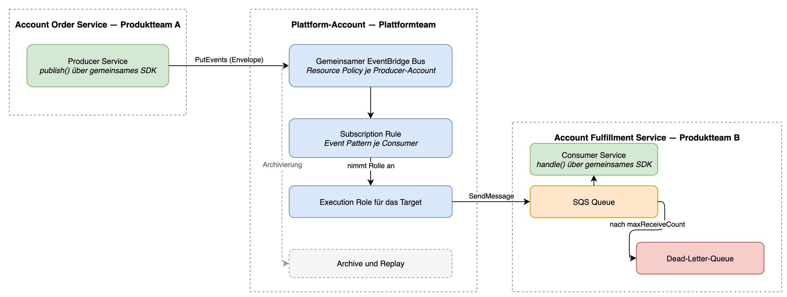

# Plattform für asynchrone Kommunikation

<!--
Ergebnis zur Aufgabe in docs/PlatformAufgabeE.pdf. Grenze: 6 Seiten.
Das Seitenbudget in jeder Überschrift dient der Priorisierung.
-->

## 1. Kontext und Ziel — 0,5 Seiten

### 1.1 Ausgangslage

Zwölf Produktteams betreiben mehr als zwanzig Services. Asynchrone
Kommunikation ist je Team gewachsen: Queues, Cronjobs und eigene Worker. Es gibt
keinen Standard für Events, Retries, Fehlerbehandlung oder Monitoring. Sobald
eine Message eine Teamgrenze überschreitet, ist die Ownership unklar. Messages
gehen verloren, und das Debugging eines Flows heißt, drei Accounts von Hand zu
lesen.

### 1.2 Ziel

Ein Golden Path für asynchrone Kommunikation zwischen Services. Ein Team muss
ein Domain-Event veröffentlichen oder abonnieren können, ohne Transport, Retries
oder Fehlerbehandlung selbst zu entwerfen.

Wir sind fertig, wenn:

- ein Produkt-Team ein Event per Pull Request bestimmte Events abonnieren kann;
- jedes Event einen Owner, ein Schema und einen veröffentlichten Namen hat;
- keine Message still verloren gehen kann und jeder Fehler dort landet, wo ein Mensch
  ihn sieht;
- das Plattformteam nicht im kritischen Pfad einer Routine-Subscription steht.

### 1.3 Nicht-Ziele: was wir bewusst nicht bauen

- **Einen Command-Bus.** Siehe 2.3. Punkt-zu-Punkt-Kommunikation bekommt eine
  Queue, nicht den gemeinsamen Bus.
- **IAM-Policies für Produkt-Identitäten.** Ein Team, das das AWS SDK aufruft,
  kennt die nötige Berechtigung.
- **Eine Schema Registry, in der ersten Iteration.** Konventionen für Envelope und Eventstruktur reichen,
  bis der Event-Katalog darüber hinauswächst.
- **Self-Service Account Vending oder ein Entwicklerportal.** Pull Requests auf
  ein Repository decken zwölf Teams ab.
- **Multi-Region und Disaster Recovery.** Eine Region, bis eine fachliche
  Anforderung etwas anderes verlangt.
- **Event Sourcing.** Der Bus ist Transport. Er ist kein System of Record.

## 2. Architektur und Design — 2 Seiten

### 2.1 Zielarchitektur



Ein Producer im Account des Order Service veröffentlicht über `PutEvents` auf
den gemeinsamen Bus. Eine Rule je Subscription filtert auf den Inhalt und stellt
über eine Execution Role in die SQS Queue im Account des Consumers zu. Die
Dead-Letter-Queue nimmt auf, was der Consumer wiederholt nicht verarbeiten kann.

### 2.2 Auswahl der AWS Services und geprüfte Alternativen

Ein eigener **EventBridge** Event Bus in einem Plattform-Account trägt jedes
Domain-Event. **SQS** gibt jeder Subscription einen eigenen dauerhaften Puffer im
Account des konsumierenden Teams.

EventBridge entscheidet das Routing, denn seine Rules filtern auf den Inhalt
eines Events. Ein Consumer erklärt, was er will; ein Producer erfährt nie, wer
zuhört. SQS entscheidet die Zustellung, denn eine Queue puffert Last, übersteht
einen Ausfall des Consumers und unterstützt eine Dead-Letter-Queue.

| Option | Verworfen, weil |
|---|---|
| SNS und SQS | Einfacher zu erklären, aber das Routing wird mit dem Wachstum der Plattform unübersichtlich. Fan-out braucht ein Topic je Event-Typ, und Filter Policies prüfen Attribute statt Inhalt. |
| MSK oder Kafka | Starke Eigenschaften bei Reihenfolge und Retention. Der Betriebsaufwand ist für ein Plattformteam von fünf Personen zu hoch. |
| Queue je Service-Paar | Das ist die Ausgangslage. Sie koppelt Producer an Consumer und verdeckt die Ownership. |

Aus der Wahl folgen zwei Einschränkungen. Weder EventBridge noch eine SQS
Standard Queue garantiert die Reihenfolge. Die Zustellung erfolgt mindestens
einmal, deshalb müssen Consumer idempotent sein. Siehe 2.5.

### 2.3 Events und Commands

Die Plattform unterstützt **Events**. Wir bauen keinen Command-Bus.

Ein Event nennt eine Tatsache, die bereits eingetreten ist. Der Producer besitzt
das Schema und kennt seine Consumer nicht. Ein Command weist einen benannten
Empfänger an zu handeln. Der Empfänger besitzt das Schema, und der Sender muss
wissen, dass der Empfänger existiert. Genau diese Kopplung soll asynchrone
Kommunikation auflösen.

EventBridge entscheidet die Frage. Seine Rules sind Inhaltsfilter, die der
Consumer definiert. Legt man ein Command auf den gemeinsamen Bus, wird aus „wer
führt das aus“ ein „wer auf das Pattern passt“. Die Garantie auf genau einen
Handler ist weg.

Teams brauchen trotzdem asynchrone Punkt-zu-Punkt-Kommunikation. Fast immer
wollen sie Lastausgleich, Retries und Dauerhaftigkeit, nicht Routing. Dafür gibt
es ein Terraform-Modul mit Queue: SQS und eine Dead-Letter-Queue, ohne Bus und
ohne Rule. Arbeit, die eine Antwort braucht, bleibt ein synchroner HTTP-Aufruf.

Wir setzen die Trennung über Benennung durch, nicht über Werkzeuge. Events
stehen in der Vergangenheit, `OrderCreated`. Commands stehen im Imperativ,
`ShipOrder`. Ein Pull Request, der `SendEmail` auf den Bus legt, fällt damit im
Review auf.

### 2.4 Event-Schema und Envelope

Jedes Event trägt einen Plattform-Envelope um die fachliche Nutzlast. Der
Envelope enthält mindestens:

| Feld | Zweck |
|---|---|
| `id` | Unsere eigene ID, nicht die von EventBridge. Für Tracing und Idempotenz. |
| `version` | Erlaubt einem Consumer, eine Nutzlast zu lesen, für die er nicht gebaut wurde. |
| `timestamp` | Wann der Producer veröffentlicht hat, nicht wann EventBridge empfangen hat. |
| `domain` | Der Problemraum, zum Beispiel `orders`. |
| `service` | Der produzierende Service. |
| `type` | Der Event-Typ, zum Beispiel `OrderCreated`. |

Wir nutzen eine eigene ID, weil EventBridge bei einem Replay und bei einem
SDK-Retry eine neue ID vergibt. Dieselbe Tatsache kann also zweimal mit zwei
EventBridge-IDs ankommen. Unsere ID bleibt stabil, deshalb kann ein Consumer
darauf deduplizieren.

Der Envelope ist unabhängig vom Transport. Derselbe Leser arbeitet für SQS, SNS
und Kinesis. Ein späterer Wechsel des Transports schreibt den Consumer-Code
nicht neu.

Eine gemeinsame Bibliothek schreibt und liest den Envelope. Handgebaute
Envelopes heben den Zweck auf.

**Verhältnis zu den EventBridge-Feldern.** `Source`, `DetailType` und `Detail`
sind Pflichtfelder: EventBridge weist einen Eintrag ohne sie zurück. Sie
existieren also ohnehin, und die Bibliothek leitet sie aus dem Envelope ab,
damit sie nicht auseinanderlaufen:

```
Source     = <Präfix>.<domain>      com.example.orders
DetailType = <type>                 OrderCreated
Detail     = { ...Envelope, payload }
```

Die Identität eines Events routet damit über `Source` und `DetailType`.
Zusätzliche Bedingungen dürfen auf Felder in `Detail` matchen, zum Beispiel auf
einen Mandanten oder eine Region. Sie ersetzen die Identität aber nicht. Zwei
Wege für dieselbe Bedingung machen einen Rule-Diff im Review unlesbar.

### 2.5 Fehlerbehandlung: Retries, Dead-Letter-Queues, Idempotenz

Es gibt zwei unabhängige Fehlerfälle, und jeder braucht seine eigene
Dead-Letter-Queue. Sie zu verwechseln ist der häufigste Weg, ein Event zu
verlieren.

**EventBridge kann nicht an die Queue zustellen.** Die Queue Policy ist falsch,
oder das Target drosselt. EventBridge wiederholt 24 Stunden lang und bis zu
185-mal, mit exponentiellem Backoff und Jitter. Danach verwirft es das Event,
außer das Target hat eine Dead-Letter-Queue. Diese DLQ gehört zur Rule und liegt
im Plattform-Account.

**Der Consumer kann die Message nicht verarbeiten.** Die Message kehrt nach dem
Visibility Timeout in die Queue zurück. Nach `maxReceiveCount` Empfängen schiebt
die Redrive Policy sie in die Dead-Letter-Queue im Account des Consumers.

Idempotenz ist Aufgabe des Consumers, weil die Zustellung mindestens einmal
erfolgt. Der Consumer speichert die `id` aus dem Envelope und überspringt eine
Wiederholung. Die gemeinsame Bibliothek liefert das mit.

Jede Dead-Letter-Queue wird auf ihre Füllhöhe alarmiert. Eine Message in einer
DLQ ist ein Incident, keine Statistik. Siehe 5.3.

### 2.6 Zugang, Security und Isolation

An jeder Account-Grenze müssen beide Seiten zustimmen. Keine einzelne Policy
gewährt den Zugriff allein.

**Veröffentlichen.** Die Resource Policy des Bus nennt den Producer-Account. Das
produzierende Team erlaubt seiner eigenen Identität `events:PutEvents` auf genau
diese Bus-ARN. Beide Seiten müssen den Aufruf zulassen.

**Zustellen.** EventBridge nimmt eine Execution Role im Plattform-Account an.
Die Identity Policy dieser Rolle erlaubt `sqs:SendMessage` auf genau eine
Queue-ARN. Die Queue Policy im Consumer-Account nennt diese Rolle als einzigen
zugelassenen Absender.

Die Isolation folgt der Account-Grenze. Die Queue eines Consumers liegt im
Account des Consumers. Ein lauter oder defekter Consumer kann deshalb kein
anderes Team beeinträchtigen. Der gemeinsame Bus ist die einzige geteilte
Komponente, und nur das Plattformteam schreibt darauf.

## 3. Terraform-Prototyp — 1 Seite

Der Prototyp ist ein lauffähiges Repository, keine Skizze. Er ist deployt, und
ein Event hat den gesamten Weg von Anfang bis Ende zurückgelegt.

### 3.1 Struktur des Repositories und Ownership

```
terraform/
├── bootstrap/                  einmalig von Hand: State Bucket, Deploy Roles
├── modules/
│   ├── event-platform/         der gemeinsame Bus und seine Resource Policy
│   └── event-consumer/         Subscription: Rule, Target, Queue, DLQ
└── stacks/
    ├── platform/               Plattformteam; producers.tf registriert Producer
    └── consumers/
        └── fulfillment-service/   Produktteam B
apps/
├── order-service/              veröffentlicht OrderCreated
└── fulfillment-service/        konsumiert es
```

Ein Repository, im Besitz des Plattformteams. Ein Produktteam öffnet einen Pull
Request. `CODEOWNERS` verlangt die Freigabe der Plattform, und eine Pipeline
wendet jeden Stack an.

Der State ist je Stack getrennt, nicht je Repository. Ein Apply eines
Produktteams kann den gemeinsamen Bus nicht beschädigen.

Stacks tragen den Namen des Service, dem sie gehören, nie den des AWS Accounts.
Ein Account ist ein Ziel für ein Deployment. Der Consumer-Stack zeigt das: er
deployt in zwei Accounts, denn eine EventBridge Rule muss dem Account gehören,
dem auch der Bus gehört.

### 3.2 Defaults und Wiederverwendbarkeit

Das Modul `event-consumer` ist die gesamte Schnittstelle für Entwickler. Eine
Subscription ist ein Modulblock mit einem Event Pattern, einem Namen für die
Queue und einem Namen für die Rule. Den Rest setzt das Modul: Redrive Policy,
`maxReceiveCount`, Retention, die Execution Role und beide Resource Policies.

Das Modul deklariert zwei Provider-Aliase, `aws.platform` und `aws.consumer`. Es
konfiguriert keine Credentials, keine Region und kein Assume Role. Das Root
liefert diese, deshalb arbeitet dasselbe Modul für jeden Consumer-Account.

Stacks lösen den Bus über seinen Namen mit einer Data Source auf. Kein Stack
liest den State eines anderen Stacks, und niemand kopiert eine ARN.

### 3.3 Was der Prototyp zeigt und was er auslässt

Durch Anwenden und ein Testevent nachgewiesen:

- ein Event überschreitet drei Account-Grenzen und kommt in der Queue des
  Consumers an;
- ein Event, das nicht auf das Pattern passt, wird an der Rule verworfen und
  nicht erst zugestellt;
- das Berechtigungsmodell funktioniert mit engen Policies auf beiden Seiten.

Bewusst ausgelassen:

- der Envelope und die gemeinsame Bibliothek; die Beispiele veröffentlichen ein
  nacktes Event;
- die Dead-Letter-Queue an der Rule aus 2.5, die erste Lücke, die zu schließen
  ist;
- Least Privilege beim Deployment; die Pipeline nutzt je Account eine
  administrative Rolle;
- Alarme, Dashboards und Tracing.

## 4. Developer Experience und Golden Path — 1,5 Seiten

### 4.1 Ein Event veröffentlichen

### 4.2 Ein Event abonnieren

### 4.3 Abstraktionen: SDK, Terraform-Modul, Templates

### 4.4 Onboarding und Adoption

## 5. Betrieb und Stabilität — 0,75 Seiten

### 5.1 Monitoring und Alarmierung

### 5.2 Debugging eines Event-Flows

### 5.3 Fehler und Incidents

## 6. Vision und Weiterentwicklung — 0,25 Seiten
