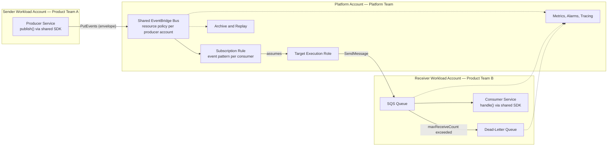

# Async Communication Platform

<!--
Deliverable for docs/PlatformAufgabeE.pdf. Limit: 6 pages.
Structure only. The page budget in each heading is a guide for prioritisation.
-->

## 1. Context and Goal — 0.5 p

### 1.1 Status quo

### 1.2 Goal

### 1.3 Non-goals: what we deliberately do not build

## 2. Architecture and Design — 2 p

### 2.1 Target architecture

### 2.2 Choice of AWS services, and the alternatives considered

### 2.3 Events and commands

### 2.4 Event schema and envelope

### 2.5 Error handling: retries, dead-letter queues, idempotency

### 2.6 Access, security and isolation

## 3. Terraform Prototype — 1 p

### 3.1 Repository structure and ownership

### 3.2 Defaults and reusability

### 3.3 What the prototype proves, and what it leaves out

## 4. Developer Experience and Golden Path — 1.5 p

### 4.1 Publishing an event

### 4.2 Subscribing to an event

### 4.3 Abstractions: SDK, Terraform module, templates

### 4.4 Onboarding and adoption

## 5. Operation and Stability — 0.75 p

### 5.1 Monitoring and alerting

### 5.2 Debugging an event flow

### 5.3 Errors and incidents

## 6. Vision and Next Steps — 0.25 p
