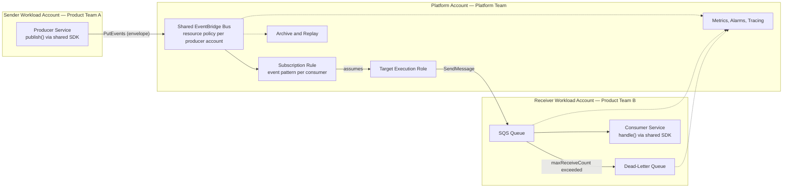

# Async Communication Platform

<!--
Deliverable for docs/PlatformAufgabeE.pdf. Limit: 6 pages.
Structure only. The page budget in each heading is a guide for prioritisation.
-->

## 1. Context and Goal — 0.5 p

### 1.1 Status quo

Twelve product teams run more than twenty services. Asynchronous communication
grew per team: queues, cron jobs and custom workers. There is no standard for
events, retries, error handling or monitoring. Nobody owns a message once it
crosses a team boundary. Messages get lost, and debugging a flow means reading
three accounts by hand.

### 1.2 Goal

Provide one paved road for asynchronous communication between services. A team
must be able to publish a domain event, or subscribe to one, without designing
transport, retries or error handling.

We are done when:

- a team subscribes to an event with one reviewed pull request;
- every event has one owner, one schema and one published name;
- no message is lost silently, and every failure lands somewhere a human can
  see it;
- the platform team is not on the critical path of a routine subscription.

### 1.3 Non-goals: what we deliberately do not build

- **A command bus.** See 2.3. Point-to-point work gets a queue, not the shared
  bus.
- **IAM policies for product identities.** A team that calls the AWS SDK knows
  which permission it needs. A policy we hand over enforces nothing.
- **A schema registry, in the first iteration.** The envelope plus review is
  enough until the event catalogue outgrows it.
- **Self-service account vending or a developer portal.** Pull requests to one
  repository cover twelve teams.
- **Multi-region and disaster recovery.** Single region until a business
  requirement asks otherwise.
- **Event sourcing.** The bus is transport. It is not a store of record.

## 2. Architecture and Design — 2 p

### 2.1 Target architecture



### 2.2 Choice of AWS services, and the alternatives considered

One custom **EventBridge** event bus in a platform account carries every domain
event. **SQS** gives each subscription its own durable buffer in the consuming
team's account.

EventBridge decides routing, because its rules filter on event content. A
consumer declares what it wants; a producer never learns who listens. SQS
decides delivery, because a queue absorbs load, survives a consumer outage and
supports a dead-letter queue.

| Option | Rejected because |
|---|---|
| SNS plus SQS | Simpler to explain, but routing degrades as the platform grows. Fan-out needs a topic per event type, and filter policies match attributes rather than content. |
| MSK or Kafka | Strong ordering and retention. The operational cost is too high for a platform team of five. |
| Queue per pair of services | This is the status quo. It couples producer to consumer and hides ownership. |

Two constraints follow from the choice. Neither EventBridge nor an SQS standard
queue guarantees order. Delivery is at least once, so consumers must be
idempotent. See 2.5.

### 2.3 Events and commands

We support **events** on the platform. We do not build a command bus.

An event states a fact that already happened. The producer owns the schema and
does not know its consumers. A command instructs one named receiver to act. The
receiver owns the schema, and the sender must know that the receiver exists.
That is the coupling asynchronous messaging is meant to remove.

EventBridge settles the question. Its rules are consumer-defined content
filters. Put a command on the shared bus and "who executes this" becomes
"whoever matches the pattern". The single-handler guarantee is gone.

Teams still need asynchronous point-to-point work. Almost always they want load
levelling, retries and durability, not routing. They get a queue-only Terraform
module: SQS plus a dead-letter queue, no bus and no rule. Work that needs an
answer stays a synchronous HTTP call.

We enforce the split by naming, not by tooling. Events use the past tense,
`OrderCreated`. Commands use the imperative, `ShipOrder`. A pull request that
adds `SendEmail` to the bus is then visible in review.

### 2.4 Event schema and envelope

Every event carries a platform envelope around the domain payload. The envelope
holds at least:

| Field | Purpose |
|---|---|
| `id` | Our own id, not the EventBridge id. Used for tracing and for idempotency. |
| `version` | Lets a consumer parse a payload it was not built for. |
| `timestamp` | When the producer published, not when EventBridge received. |
| `domain` | The problem space, for example `orders`. |
| `service` | The producing service. |
| `type` | The event type, for example `OrderCreated`. |

We use our own id because EventBridge assigns a new id on a replay and on an
SDK retry. The same fact can therefore arrive twice with two EventBridge ids.
Our id stays stable, so a consumer can deduplicate on it.

The envelope is transport independent. The same reader works for SQS, SNS and
Kinesis, so a later change of transport does not rewrite consumer code.

A shared library writes and reads the envelope. Hand-rolled envelopes defeat the
purpose.

### 2.5 Error handling: retries, dead-letter queues, idempotency

There are two independent failure modes, and each needs its own dead-letter
queue. Confusing them is the most common way to lose an event.

**EventBridge cannot deliver to the queue.** The queue policy is wrong, or the
target throttles. EventBridge retries for 24 hours and up to 185 times, with
exponential backoff and jitter. After that it drops the event, unless the target
declares a dead-letter queue. This DLQ belongs to the rule and lives in the
platform account.

**The consumer cannot process the message.** The message returns to the queue
after the visibility timeout. After `maxReceiveCount` receives, the redrive
policy moves it to the queue dead-letter queue in the consuming account.

Idempotency is the consumer's duty, because delivery is at least once. The
consumer stores the envelope `id` and skips a repeat. The shared library
provides this.

Every dead-letter queue is alarmed on depth. A message that reaches a DLQ is an
incident, not a statistic. See 5.3.

### 2.6 Access, security and isolation

Each account boundary needs both sides to agree. No single policy grants access
on its own.

**Publishing.** The bus resource policy names the producing account. The
producing team grants its own identity `events:PutEvents` on that bus ARN. Both
must allow the call.

**Delivery.** EventBridge assumes an execution role in the platform account. The
role's identity policy allows `sqs:SendMessage` on one queue ARN. The queue
policy in the consuming account names that role as the only allowed sender.

Isolation follows the account boundary. A consumer's queue lives in the
consumer's account, so a noisy or broken consumer cannot affect another team.
The shared bus is the only common component, and only the platform team writes
to it.

## 3. Terraform Prototype — 1 p

The prototype is a working repository, not a sketch. It is deployed, and one
event has travelled the whole path end to end.

### 3.1 Repository structure and ownership

```
terraform/
├── bootstrap/                  run once by hand: state bucket, deploy roles
├── modules/
│   ├── event-platform/         the shared bus and its resource policy
│   └── event-consumer/         subscription: rule, target, queue, DLQ
└── stacks/
    ├── platform/               Platform Team; producers.tf registers producers
    └── consumers/
        └── fulfillment-service/   Product Team B
apps/
├── order-service/              publishes OrderCreated
└── fulfillment-service/        consumes it
```

One repository, owned by the platform team. A product team opens a pull request.
`CODEOWNERS` requires platform approval, and one pipeline applies every stack.

State is split per stack, not per repository. A product team's apply cannot
damage the shared bus.

Stacks are named after the service that owns them, never after the AWS account.
An account is a deployment target. The consumer stack proves the point: it
deploys into two accounts, because an EventBridge rule must belong to the
account that owns the bus.

### 3.2 Defaults and reusability

The `event-consumer` module is the whole developer interface. A subscription is
a module block with an event pattern, a queue name and a rule name. The module
sets the rest: redrive policy, `maxReceiveCount`, retention, the execution role
and both resource policies.

The module declares two provider aliases, `aws.platform` and `aws.consumer`. It
configures no credentials, no region and no role assumption. The root supplies
those, so the same module works for any consuming account.

Stacks resolve the bus by name with a data source. No stack reads another
stack's state, and nobody pastes an ARN.

### 3.3 What the prototype proves, and what it leaves out

Proved by applying it and publishing a test event:

- an event crosses three account boundaries and arrives in the consuming queue;
- an event that does not match the pattern is dropped at the rule, not delivered
  and discarded later;
- the permission model works with narrow policies on both sides.

Left out on purpose:

- the envelope and the shared library; the samples publish a bare event;
- the rule-level dead-letter queue described in 2.5, which is the first gap to
  close;
- least privilege at deploy time; the pipeline uses one administrative role per
  account;
- alarms, dashboards and tracing.

## 4. Developer Experience and Golden Path — 1.5 p

### 4.1 Publishing an event

### 4.2 Subscribing to an event

### 4.3 Abstractions: SDK, Terraform module, templates

### 4.4 Onboarding and adoption

## 5. Operation and Stability — 0.75 p

### 5.1 Monitoring and alerting

### 5.2 Debugging an event flow

### 5.3 Errors and incidents

## 6. Vision and Next Steps — 0.25 p
